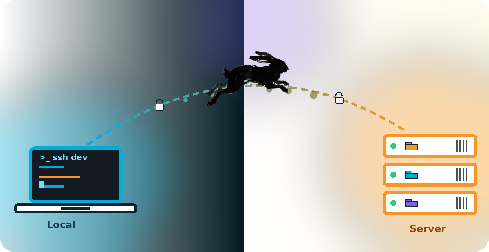

<div align="center">



# 🐇💨 hop
**SSH Project Launcher & Directory Jumper**

Lompat langsung ke server dan direktori project favorit Anda — tanpa `history | grep` lagi.

[](https://go.dev)
[](LICENSE)
[]()
[]()

</div>

---

`hop` adalah CLI ringan berbasis Go untuk mempermudah koneksi SSH dan *directory jumping* — otomatis masuk ke direktori project yang tepat begitu Anda terhubung ke server. Tanpa dependensi eksternal yang berat, murni *shell out* ke binary `ssh` bawaan sistem Anda.

> Dulu: `history | grep <ip>` → `!<no>` → `history | grep <project>` → `!<no>`
> Sekarang: `hop <alias>` ✨

## 📚 Daftar Isi

- [Fitur Utama](#-fitur-utama)
- [Instalasi](#-instalasi)
- [Dependency & Requirement](#-dependency--requirement)
- [Autentikasi & Auto-Login](#-autentikasi--auto-login)
- [Konfigurasi](#️-konfigurasi-configyaml)
- [Penggunaan](#-penggunaan)
- [Autocomplete](#️-autocomplete-tab-di-bash)

---

## ✨ Fitur Utama

| Fitur | Deskripsi |
|---|---|
| 🗂️ **Multi-Path per Host** | Satu server bisa punya banyak direktori project, masing-masing dengan alias sendiri |
| 🚀 **Auto Jumper** | Otomatis `cd` ke path tujuan begitu SSH berhasil terhubung |
| 📦 **Auto-Install Deps** | Otomatis menginstal `libsecret-tools` & `sshpass` (Debian/Ubuntu) jika belum ada |
| 📋 **Tabel Rapi** | Output `hop list` & `hop path-list` mudah dibaca sekilas |
| 🛠️ **Manajemen Interaktif** | `add`, `edit`, `remove`, `path-add`, `path-remove` — semua dipandu prompt bahasa Indonesia |
| 🔄 **Migrasi Otomatis** | Config lama otomatis dicadangkan & dikonversi ke skema terbaru |
| ⌨️ **Autocomplete Pintar** | Tab-completion untuk command, alias host, dan alias path |

---

## 💻 Instalasi

<details open>
<summary><b>🐧 Linux / macOS</b></summary>

**Prasyarat:** Go 1.20+ (`go version`) dan binary `ssh` sudah terpasang.

```bash
# 1. Compile
go build -o hop .

# 2. Pasang ke PATH
cp hop ~/.local/bin/
# atau untuk seluruh user di sistem:
sudo cp hop /usr/local/bin/

# 3. Verifikasi
hop help
```

</details>

<details>
<summary><b>🪟 Windows</b></summary>

**Prasyarat:** Go compiler, OpenSSH Client aktif (default di Windows 10/11), PowerShell/Windows Terminal.

```powershell
# 1. Compile
go build -o hop.exe .

# 2. Pasang ke folder khusus
New-Item -ItemType Directory -Force -Path "C:\bin"
Copy-Item hop.exe -Destination "C:\bin\hop.exe"

# 3. Tambahkan C:\bin ke Environment Variable PATH
#    (Start Menu → "Edit the system environment variables")
```

> ⚠️ **Penting:** `hop` mencari config lewat variabel `HOME`, yang tidak selalu ada di Windows secara default. Tambahkan environment variable baru: `HOME` = `C:\Users\NamaUserAnda`.

```powershell
# 4. Verifikasi
hop.exe help
```

</details>

---

## 📋 Dependency & Requirement

### Wajib (untuk semua fitur hop)

| Package | Tujuan | Install |
|---------|--------|--------|
| **Go** 1.20+ | Build dari source | [go.dev](https://go.dev/doc/install) |
| **ssh** (OpenSSH) | Koneksi SSH | Bundled di Linux/macOS/Windows 10+ |

### Opsional (auto-install jika dibutuhkan)

Saat Anda memilih autentikasi password di `hop add` atau `hop edit`, hop akan otomatis mengecek dan menginstal package berikut (dengan prompt sudo password):

| Package | Fungsi |
|---------|--------|
| **libsecret-tools** | Menyimpan password di OS keyring (via `secret-tool`) |
| **sshpass** | Autentikasi password SSH non-interaktif |

Auto-install berjalan dengan:
- Pengecekan ketersediaan package
- Prompt sudo password jika diperlukan
- Spinner progress saat instalasi
- Feedback sukses/gagal yang jelas

---

## 🔑 Autentikasi & Auto-Login

`hop` mendukung **dua metode autentikasi SSH** yang bisa dipakai secara terpisah maupun fallback:

| Metode | Keamanan | Auto-Login |
|--------|----------|------------|
| 🔑 **SSH Key** | ⭐⭐⭐ Sangat aman | ✅ Native (semua OS) |
| 🔓 **Password** (via sshpass) | ⭐ Cukup | ✅ Hanya via `sshpass` |

### 🔑 Autentikasi SSH Key (Recommended)

#### 1. Generate SSH Key

```bash
ssh-keygen -t ed25519 -C "email@domain.com"
```

Hasil: `~/.ssh/id_ed25519` (private) & `~/.ssh/id_ed25519.pub` (public).

#### 2. Daftarkan Public Key ke Server

```bash
ssh-copy-id user@server-ip
```

#### 3. Konfigurasi `hop`

Saat `hop add`, isi field **Path File SSH Key** dengan path private key, misal `~/.ssh/id_ed25519`.

Atau langsung di `config.yaml`:
```yaml
hosts:
  - alias: prod-server
    host: 192.168.1.100
    user: user
    port: 22
    identity_file: ~/.ssh/id_ed25519
```

### 🔓 Autentikasi Password (via sshpass)

Password **TIDAK disimpan plaintext** di `config.yaml`. Saat `hop add`, jawab **y** pada pertanyaan autentikasi password, lalu password akan:

1. **Otomatis menginstal** `libsecret-tools` & `sshpass` jika belum ada (dengan prompt sudo password)
2. **Menyimpan password** ke OS keyring (`secret-tool`)
3. `config.yaml` tetap bebas credential

```
🔐 Gunakan autentikasi password? (y/N) [N]: y
📦 Memasang package...
   🔐 Membutuhkan akses sudo untuk instalasi. Masukkan password OS Anda: ****
   Memasang libsecret-tools... ✓
   Memasang sshpass... ✓
   🔒 Password: ********
   🔒 Password disimpan di OS keyring.
```

> **Catatan:** Jika `secret-tool` tidak tersedia, password akan disimpan di `config.yaml` sebagai fallback (dengan peringatan).

### Hapus Password dari Keyring

```bash
hop secret-remove <host-alias>
```

---

## 🛠️ Konfigurasi (`config.yaml`)

Dibuat otomatis saat `hop` pertama kali dijalankan.

| OS | Lokasi |
|---|---|
| Linux/macOS | `~/.config/hop/config.yaml` |
| Windows | `%HOME%\.config\hop\config.yaml` |

```yaml
hosts:
  - alias: dev-projek
    host: xx.xx.xx.xx
    user: root
    port: 22
    identity_file: ~/.ssh/id_rsa
    # password: secret123   # Hanya fallback legacy
    paths:
      - alias: projek1
        path: /var/www/html/projek1
      - alias: projek2
        path: /var/www/html/projek2
        command: php artisan serve
```

| Field | Keterangan |
|-------|------------|
| `alias` | Nama unik untuk memanggil host di CLI |
| `host` | IP atau hostname server SSH |
| `user` | Username login SSH |
| `port` | Port SSH (default `22`) |
| `identity_file` | Path ke SSH private key (opsional) |
| `password` | **Hanya fallback legacy** — preferensi utama: OS keyring |
| `paths[].alias` | Nama singkat direktori (dipakai saat connect) |
| `paths[].path` | Path tujuan di server |
| `paths[].command` | Perintah default setelah cd (opsional) |

---

## 📑 Penggunaan

### Koneksi cepat

```bash
hop <host-alias>               # connect, otomatis masuk ke path pertama
hop <host-alias> <path-alias>  # connect ke path spesifik
```

```bash
hop dev-projek           # default path
hop dev-projek projek2   # path spesifik
```

### Perintah default & override

```bash
hop dev-projek projek2           # cd + command default (kalau ada)
hop dev-projek projek2 -- htop   # override: jalankan htop, bukan command default
```

### Manajemen host & path

| Command | Fungsi |
|---|---|
| `hop list` | Lihat semua host terdaftar |
| `hop add` | Tambah host baru (interaktif) |
| `hop edit <host>` | Ubah detail host |
| `hop remove <host>` | Hapus host |
| `hop doctor` | Cek tools & koneksi ke semua host |
| `hop exec <host> -- <cmd>` | Jalankan command non-interaktif |
| `hop secret-remove <host>` | Hapus password dari OS keyring |
| `hop path-list [<host>]` | Lihat semua path (semua host / spesifik) |
| `hop path-add <host>` | Tambah path baru ke host |
| `hop path-edit <host> <path>` | Ubah detail path |
| `hop path-remove <host> <path>` | Hapus path dari host |

### 🩺 Hop Doctor

Cek tools sistem & koneksi ke semua host terdaftar sekaligus.

```bash
hop doctor
# 🔧 Memeriksa tools yang dibutuhkan...
# ✓ ssh          terpasang
# ✓ secret-tool  terpasang
# ✓ sshpass      terpasang
#
# 🌐 Memeriksa koneksi ke semua Host...
# ✓ dev-projek           1.2.3.4 — 45ms
# ✗ prod-server          5.6.7.8 — koneksi ditolak
# ...
# Selesai: 1 OK, 1 gagal dari 2 Host.
```

### ⚡ Hop Exec (Non-Interaktif)

Jalankan perintah langsung di server tanpa masuk sesi shell.

```bash
hop exec dev-projek -- echo "halo"
hop exec dev-projek projek1 -- ls -l
```

<details>
<summary>Contoh output <code>hop list</code></summary>

```
IP/HOST      ALIAS       USER   PORT   PATHS
-------      -----       ----   ----   -----
xx.xx.xx.xx  dev-projek  root   22     projek1, projek2
```

</details>

<details>
<summary>Contoh output <code>hop path-list</code></summary>

```
IP/HOST      ALIAS         PATH                       PATH ALIAS
-------      -----         ----                       ----------
xx.xx.xx.xx  dev-projek    /var/www/html/projek1      projek1
xx.xx.xx.xx  dev-projek    /var/www/html/projek2      projek2
```

</details>

---

## ⌨️ Autocomplete (Tab) di Bash

Aktifkan sekali, pakai selamanya:

```bash
hop completion bash >> ~/.bashrc
source ~/.bashrc
```

**Cara pakai:**
1. `hop <Tab><Tab>` → daftar semua command & host alias
2. `hop dev-<Tab>` → otomatis lengkap jadi `hop dev-projek `
3. `hop dev-projek <Tab>` → daftar path-alias milik host tersebut

> 💡 Kalau beberapa alias berbagi awalan sama (`projek1`, `projek2`), Tab akan mengisi sebanyak yang unik (`projek`), lalu Anda lanjutkan ketik pembedanya.

---

<div align="center">

Dibuat untuk mempercepat workflow development sehari-hari 🐇💨

</div>
